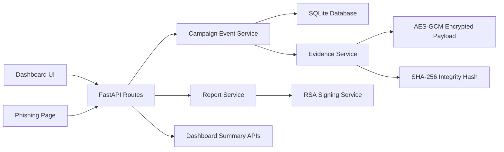

# ShadowTrace Backend

ShadowTrace is a FastAPI-based phishing investigation and cryptographic forensics platform. It combines:

- controlled phishing simulation
- suspicious event capture
- encrypted evidence sealing
- tamper verification
- signed incident reporting
- audit-chain visibility through a darker, operations-style dashboard

## Core Features

- JWT authentication with admin and analyst access
- phishing campaign creation and public tracking links
- fake phishing landing page with controlled credential capture flow
- AES-GCM encrypted evidence storage
- SHA-256 integrity verification and compromised-status detection
- RSA-signed incident report export
- dashboard views for overview, campaigns, incidents, evidence, and audit history
- campaign timeline view for complete incident reconstruction

## Run Locally

```powershell
python -m venv .venv
.\.venv\Scripts\Activate.ps1
pip install -r requirements.txt
Copy-Item .env.example .env
uvicorn app.main:app --reload
```

## URLs

- API docs: `http://127.0.0.1:8000/docs`
- Dashboard UI: `http://127.0.0.1:8000/`
- Health check: `http://127.0.0.1:8000/api/v1/health`

## Demo Data Workflow

Seed a ready-to-demo environment:

```powershell
.\.venv\Scripts\python.exe .\scripts\seed_demo.py
```

Reset demo records while keeping user accounts:

```powershell
.\.venv\Scripts\python.exe .\scripts\reset_demo.py
```

Reset everything including users:

```powershell
.\.venv\Scripts\python.exe .\scripts\reset_demo.py --drop-users
```

Default seeded login:

- `admin@gmail.com`
- `ShadowTrace123`

## Test Suite

Run the backend tests with:

```powershell
.\.venv\Scripts\python.exe -m unittest discover -s tests -v
```

The tests use an isolated temporary SQLite database, so they do not touch your live demo data.

## Suggested Demo Flow

1. Sign in to the dashboard.
2. Create a campaign from the `Campaigns` tab.
3. Open the phishing link.
4. Submit the fake phishing form.
5. Return to the dashboard and inspect:
   - `Incidents`
   - `Campaign Timeline`
   - `Evidence`
   - `Audit`
6. Run evidence verification.
7. Generate and download the signed incident report.
8. Optionally tamper with an evidence hash in SQLite and verify again to show compromise detection.

## Architecture Snapshot



## Project Structure

- `app/main.py`: FastAPI app setup and static file mounting
- `app/core/config.py`: environment-backed settings
- `app/db/`: SQLAlchemy engine, sessions, and model registration
- `app/models/`: users, campaigns, events, evidence, and audit entities
- `app/api/routes/auth.py`: register, login, and current-user endpoints
- `app/api/routes/campaigns.py`: campaigns, evidence, verification, reports, and audit log routes
- `app/api/routes/dashboard.py`: overview, incidents, campaign timeline, and audit feed routes
- `app/ui/routes.py`: dashboard entry routes
- `app/ui/phishing.py`: phishing simulation and awareness pages
- `app/static/`: dashboard and phishing page assets
- `app/services/`: audit, evidence, campaign event, report, signing, and security helpers
- `scripts/seed_demo.py`: one-command demo data generator
- `scripts/reset_demo.py`: demo data reset utility
- `tests/`: isolated API tests for auth and phishing/evidence flow
